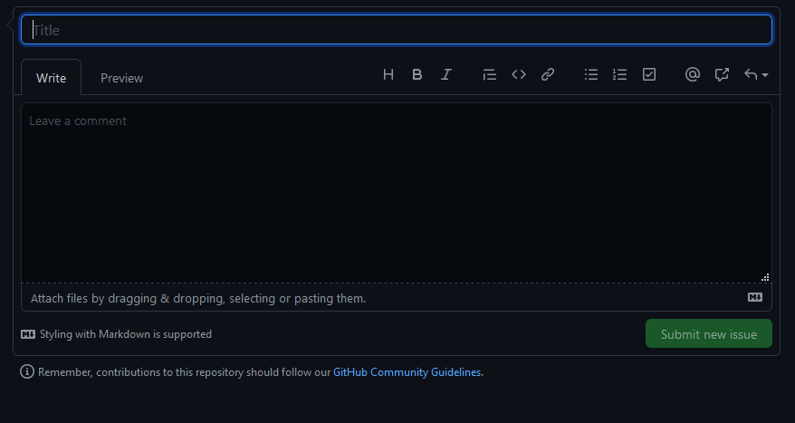

# APIPresentation

## App Structure

[Program](https://github.com/JeffACate/APIPresentation/blob/main/APIPresentation/Program.cs) calls App

[App.cs](https://github.com/JeffACate/APIPresentation/blob/main/APIPresentation/App.cs) makes the call 

[CatFact.cs](https://github.com/JeffACate/APIPresentation/blob/main/APIPresentation/CatFact.cs) was created using Visual Studio's Paste Special (As Json class) feature. 

App.css lines 37 - 39 uses the implicate object created in line 32. 

App.css line 40+41 uses the explicate object that uses created [CatFact](https://github.com/JeffACate/APIPresentation/blob/main/APIPresentation/CatFact.cs) object created in line 34.

## Note: for any issues, questions, comments see this repos [issues page](https://github.com/JeffACate/APIPresentation/issues) 
 1) create a new issue 
 
    
 
 2) complete the issue form
    
    
 
 3) add the related labels.

    
    
